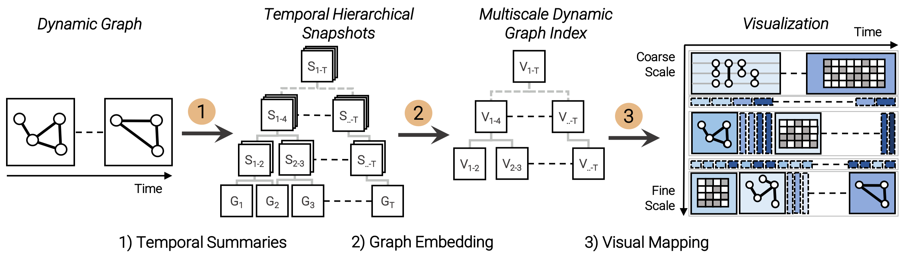

# Multiscale Snapshots

Visual Analysis of Temporal Summaries in Dynamic Graphs - [[Paper]](https://arxiv.org/abs/2008.08282)

<p align="center">
  
</p>
  
## Abstract

<p align="justify">
The overview-driven visual analysis of large-scale dynamic graphs poses a major challenge. We propose Multiscale Snapshots, a visual analytics approach to analyze temporal summaries of dynamic graphs at multiple temporal scales. First, we recursively generate temporal summaries to abstract overlapping sequences of graphs into compact snapshots. Second, we apply graph embeddings to the snapshots to learn low-dimensional representations of each sequence of graphs to speed up specific analytical tasks (e.g., similarity search). Third, we visualize the evolving data from a coarse to fine-granular snapshots to semi-automatically analyze temporal states, trends, and outliers. The approach enables us to discover similar temporal summaries (e.g., reoccurring states), reduces the temporal data to speed up automatic analysis, and to explore both structural and temporal properties of a dynamic graph. We demonstrate the usefulness of our approach by a quantitative evaluation and the application to a real-world dataset.
</p>

_This repository provides a Python/Javascript implementation of Multiscale Snapshots prototype as described in the paper:_

```bibtex
@inproceedings{CaScJa+2020Multiscale,
 author = {Cakmak, Eren and Schlegel, Udo and Jäckle, Dominik and Keim, Daniel A. and Schreck, Tobias},
 booktitle = {IEEE Transactions on Visualization and Computer Graphics (to appear)},
 pages = {11},
 title = {Multiscale Snapshots: Visual Analysis of Temporal Summaries in Dynamic Graphs},
 year = {2020}
}
```

---

### How to locally run the prototype

1. Install Python requirements

```bash
pip install -r requirements.txt
```

2. Run ```app.py``` with Pyhton e.g., 

```bash
python3 app.py
```

3. Access the prototype implementation in the web browser

```url
http://127.0.0.1:8000/
```

---

### How to locally develop the prototype

First, install the `node.js` modules and run wepack. Move the to the `/frontend` directory and run the following commands while working on the frontend:

```bash
npm install
npm run watch
```

---

### Datasets & Graph Embeddings

The following dataset is currently used in the prototype [Reddit Hyperlink Network](https://snap.stanford.edu/data/soc-RedditHyperlinks.html). The graphs were embedded using the [Karate Club](https://github.com/benedekrozemberczki/karateclub) library.

---

## License
Released under GNU General Public License v3.0. See the [LICENSE](LICENSE) file for details.
The prototype was developed by Eren Cakmak from the [Data Analysis and Visualization Group](https://www.vis.uni-konstanz.de/) at the University Konstanz funded by the Deutsche Forschungsgemeinschaft (DFG, German Research Foundation) under Germany's Excellence Strategy – EXC 2117 – 422037984 and the European Union’s Horizon 2020 research and innovation programme under grant agreement No 830892.
